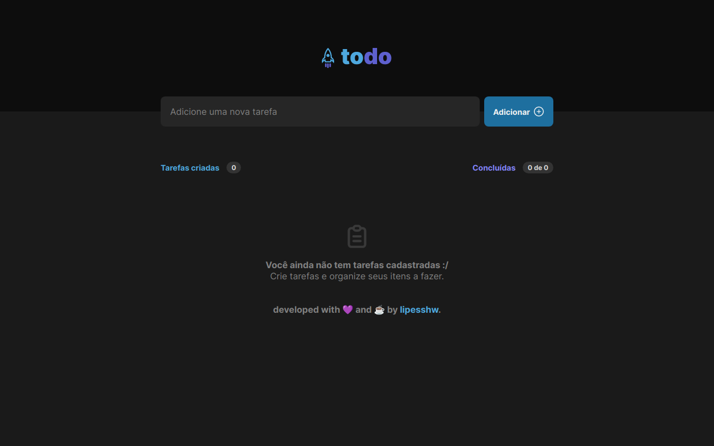

<p>
  
</p>

# ToDoApp Ignite

Aplicação de Tarefas ToDo (Desafio Ignite Rocketseat) com algumas funcionalidades extras.

## Descrição

Este projeto é uma aplicação de lista de tarefas (ToDo) desenvolvida como parte do desafio Ignite da Rocketseat. A aplicação permite que os usuários criem tarefas, as marquem como concluídas, editem o título das tarefas e as excluam. Além disso, foram adicionadas algumas funcionalidades extras, como a exibição de notificações e a categorização das tarefas.

## Funcionalidades

- Adicionar uma nova tarefa
- Marcar uma tarefa como concluída
- Editar o título de uma tarefa existente
- Excluir uma tarefa
- Categorizar tarefas concluídas e pendentes

## Tecnologias Utilizadas

- React
- React Icons
- React Toastify
- TypeScript
- Vite

## Instalação

1. Clone o repositório:
   ```
   git clone https://github.com/lipesshw/todoapp
   ```

2. Instale as dependências:
   ```
   npm install
   ```

3. E finalmente execute o projeto:
   ```
   npm run dev
   ```

